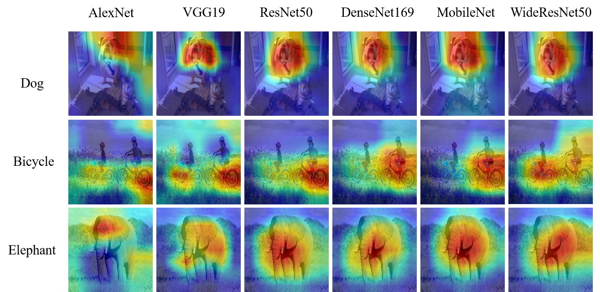
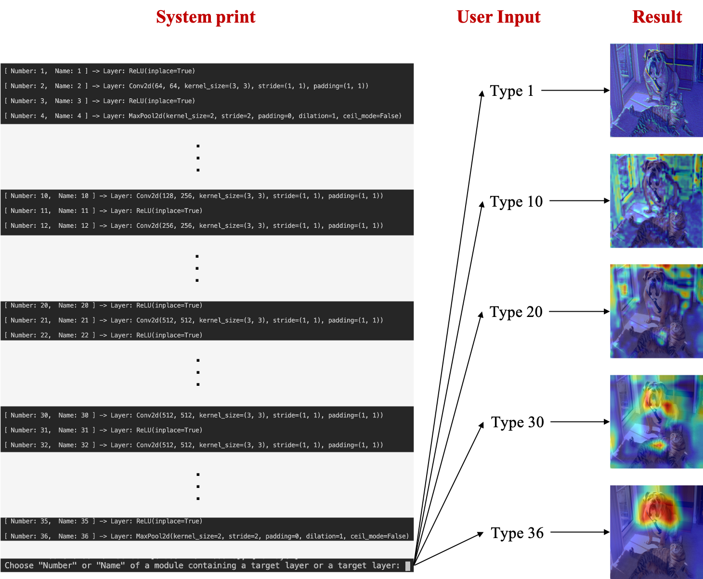

# GradCAM




## Requirements

- Pytorch 1.4.0 
- Python 3.6
- cv2 4.4.0
- matplotlib 3.3.1
- CUDA 10.1 (optional)


## Running the code

```shell
python main.py --model_path=VGG19 --img_path=examples/catdog.png --select_t_layer=False
```

Arguments:

- `model_path` - Choose a pretrained model (AlexNet, VGG19, ResNet50, DenseNet169, ) or saved model (.pt) 
	-Available list: [AlexNet, VGG19, ResNet50, DenseNet169, MobileNet, WideResNet50]
- `img_path` - Image Path
- `select_t_layer` -  Choose a target layer manually?
	-If True, you can select a layer and get GradCAM for the layer.
	-Elif False, you can get GradCAM automatically.
- `cuda` - Use cuda?
- `cuda_device` - Select a specific GPU device


### Guide for selecting a target layer manually 

If you want to select a target layer manually, you run the following code:

```shell
python main.py --model_path=VGG19 --img_path=examples/catdog.png --select_t_layer=True
```

And then, you can get system print such as the following figure (left).  
Suppose that you select(type) the features module (number 0) like as the figure (right).


Because you select the module, you get system print one more and should select a target layer in the module as described in below figure.  
Once typing the 'number' or 'name' of a target class, you can get GradCAM result.




## Understanding GradCAM

Check my blog!!
[GradCAM in da2so](https://da2so.github.io/2020-08-10-GradCAM/)